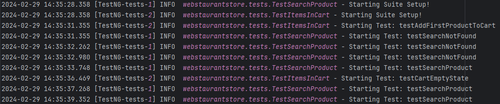
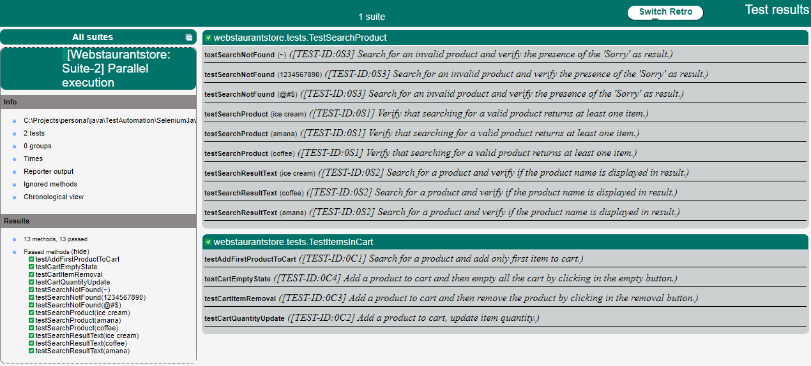

<!-- PROJECT LOGO -->
<div align="center">
  <h3 align="center">Selenium Java Test Automation</h3>
  
  <p>
    <a href="https://github.com/sschuckk/SeleniumJavaTestAutomation/issues">Report Bug</a>
    ·
    <a href="https://github.com/sschuckk/SeleniumJavaTestAutomation">Request Feature</a>
  </p>
</div>

<!-- ABOUT THE PROJECT -->
## About The Project

The objective of this project is to develop a Test Suite for a real web application [Webstaurantstore](https://www.webstaurantstore.com/),
using Selenium, Java, and TestNG. The goal is to create a straightforward testing framework with logs and reports.

This project comprises two Test Suites, each designed to validate specific functionalities of the application. 
They were crafted to ensure that all tests is expected to pass.
Please feel free to modify any dataset within the tests case to observe how the system responds to varied inputs.


### Test Plan
> 1. Perform validation on the search functionality for various products:
>    - Utilize a dataset to execute the same test with multiple input data.
>    
> 2. Validate the functionalities on the Cart Page:
>    - Perform actions such as adding, updating, and removing items from the cart.

> [!NOTE]
> Each test case can be executed independently.

### Built With


<!-- GETTING STARTED -->
## Getting Started

### Prerequisites
* Git: https://git-scm.com/downloads
* Java: https://www.oracle.com/java/technologies/downloads/
* Maven: https://maven.apache.org/install.html

### Installation

#### Clone the repository to your machine.
   ```sh
   git clone https://github.com/sschuckk/selenium-java-test-automation
   ```


<!-- USAGE EXAMPLES -->
## Usage

The project can be run by a terminal or directly in your IDE.

In your terminal go to the project folder and run:

### Running the tests using Maven:

#### Basic execution:

   ```sh
   mvn clean test
   ```
> [!NOTE]
> This will use the testNG.xml file configuration where:
> - Run all test case in parallel mode
> - One browser will be ope for each Test Class

#### Redirect the Maven terminal log to a file for debug purpose:

   ```sh
   mvn clean test --log-file ./mvn-test.log 
   ```

#### Enable full debug logging:

   ```sh
   mvn clean -X test --log-file ./mvn-test.log 
   ```

### Using surefire-report plugin

#### To generate a html report:

 ```sh
 mvn clean surefire-report:report
 ```
> [!NOTE]
> The reports will be generated at: target/surefire-reports.


<!-- LOGS AND REPORTS -->
## Logs and Reports:

The test Log and Reports serves to offer a historical record of the testing process which can be used by the testing,
development, product team, and other stakeholders.

### Logs with LOG4J:
In this project, the logs are generated using **log4j2**. 
They are set to INFO mode, and you can change the configuration in: src/test/resources/log4j2.xml. 

Each test execution will generate a log, which will be stored in the folder: src/test/java/webstaurantstore/logs.

#### Log sample: 



### Reports:
If you chose to use the html report option by executing the surefire command, the reports will be generated at: target/surefire-reports. 
Where you can have reports from surefire and from testNG.

Surefire-report sample:
